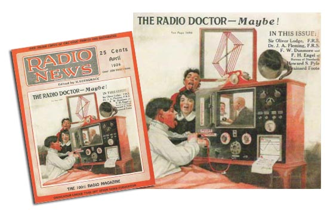

# Telemedicine
-----

## Introduction

According to [Patients Action Network](https://patientsactionnetwork.com/), Ms. Bunnie from Texas said that,
>“I'm 78 years old. Telemedicine is so much more convenient then trying to get a ride. I can keep appointments when I feel too bad to go to the doctor.”

That is how with the help of digital technologies, medical care is becoming more convenient and accessible daily. Regular hospital visits might get expensive, especially for people living in remote areas who have to waste a good amount of money and time to get better treatment. On top of that, after the Covid-19 pandemic breaks out, physical interaction has become riskier. In this situation, telemedicine can be a savior for both patients and healthcare providers. On the one hand, with the blessing of virtual technologies, one can get super-fast health care at their preferable time, and on the other hand, it can reduce the precious time and cost of the treatment.

## What is telemedicine

The prefix 'Tele' comes from the Greek, which means 'at a distance'; hence telemedicine means medicine or medical service at a distance. It refers to the use of electronic communication technologies such as video conferencing, live chat, audio assistance, and messaging to provide healthcare services remotely, including online patient consultations, telehealth nursing, remote physical and psychiatry rehabilitation, etc. It has the potential to improve access to healthcare for underserved and remote populations and increase the efficiency and effectiveness of healthcare delivery.But, as communication technologies are upgrading every second, it's hard to describe it in some words. The sector of internet consultation is getting bigger rapidly. Rather than just giving consultancy, distance operating is also involved with the help of machine learning, robotics, and, most notably, AI technologies. 
For a better understanding here is a short story explaining how telemedicine works:
<iframe src="https://www.youtube.com/embed/FsKILHHhiew" title="YouTube video player" frameborder="0" allow="accelerometer; autoplay; clipboard-write; encrypted-media; gyroscope; picture-in-picture; web-share" allowfullscreen></iframe>

## History of internet consultation in the medical sector

 
“The Radio Doctor-Maybe” was the headline of an illustration (1924) in a news magazine where a doctor was attending patients on a video call. Back then, it was just a vision, but who knew the vision would get utilized so accurately? In the early 1900s, when the radio communication system had a significant impact on the new era of communication, innovators also got concerned about giving medical treatment to rural areas over the radio. So, when was it really started? For some context, it first happened in the 1940s in Pennsylvania, where radiology images were sent 24 miles away via a telephone line between two townships. It was the first record of medical records transferred from a distance. But the evolution of telemedicine started when NASA and Indian Health had massive success with telemedicine in a partnership program. It was called Space Technology Applied to Rural Papago Advanced Health Care (STARPAHC), which provided both Native Americans on the Papago Reservation in Arizona and astronauts in orbit with access to medical care. After that, many universities, research companies, and medical centers started to put more effort with more creativity and ambition, followed by STARPAHC.

## Type of telemedicine

The usual telemedicine scenario occurs between two parties separated by time, space, or both. The client can be a patient or health worker and obtains opinions and direction from expertise. Depending on the main thread, which is communication, we can divide it into two forms. Which is,
1. Synchronous
2. Asynchronous

One form of internet consultation is synchronous communication, which involves real-time interaction between the patient and the healthcare provider through videoconferencing or voice calls. Synchronous telemedicine can be used for a variety of purposes, including consultations, diagnoses, and follow-up visits. It allows for the exchange of visual and verbal information, which can be particularly useful for conditions requiring a physical examination or assessing the patient's emotional state.
 Another form of internet consultation is asynchronous communication, which does not involve real-time interaction. Asynchronous telemedicine can take the form of email or messaging exchanges between the patient and the healthcare provider or the use of electronic forms for the patient to provide information about their condition. This type of telemedicine can be helpful in managing chronic diseases, as well as in providing information and support to patients between visits.

## Benefits of internet consultation in the medical sector

It’s said that where technological advancements are changing the health sector infrastructure, telemedicine will stay because this is the future of the medical industry. With the help of telecommunication, as patients get quality treatment without traveling hundreds of miles and wasting lots of money, medical service providers are also getting more opportunities to spread their services.
- How patients are getting benefits:

Patients who need to travel a long distance or pay a tremendous amount to get quality healthcare can now get the same health advice at their fingertips. Moreover, with the blessing of telemedicine, one can access medical care 24 hours a day. So, in any emergency case, you won’t need to wait for help to come; one can reach expertise at no time, which might save many lives. In our busy lifestyle, any of us can’t afford the time to wait in a long line to get an appointment with our desired doctor. Internet consultation can’t solve this problem in seconds. Without waiting a long time in line, you can meet the expertise from your home, school, or even the workplace. Another facility is keeping track of your health and medical services is way easier than before because every treatment you are getting, and reports get saved in cloud space automatically.
- How providers are getting benefits:

Telemedicine is also being utilized by healthcare systems, medical practices, and nursing facilities to deliver care in a more efficient manner. With the integration of technologies such as electronic medical records, AI for diagnosis, and medical streaming devices, providers are able to assist in diagnosis and treatment more effectively. This allows for real-time monitoring of patients and adjustments to treatment plans as needed, resulting in improved patient outcomes. Moreover, providers can be benefited from increased revenue by being able to see more patients without the need for additional staff or expansion of office space. For example, telemedicine experts like VSee assist providers in implementing [HIPAA-compliant telemedicine solutions](https://vsee.com/clinic) that can streamline the whole process and incredibly improve patient care. 

## Challenges and limitations of internet consultation in the medical sector

Despite the potential benefits of telemedicine, there are also challenges to implementing internet consultation in the medical sector. The first thing you need to adopt telemedicine is strong internet connectivity. But many underdeveloped countries are still struggling to ensure good internet connectivity. If this problem gets solved, there are still plenty of berries. Ensuring the privacy of your data is one of them. When you are surfing online to get your medical treatment and might be sharing your personal data over the internet, it’s pretty much risky for your privacy if you are not aware of them. 
Another big problem is that many insurance companies do not cover telemedicine services, which can be a barrier to patient access. This is particularly problematic in rural areas, where access to care may be limited, and patients may be more reliant on telemedicine as a primary source of healthcare.

( Ongoing...)
